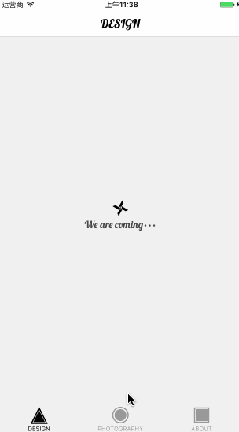
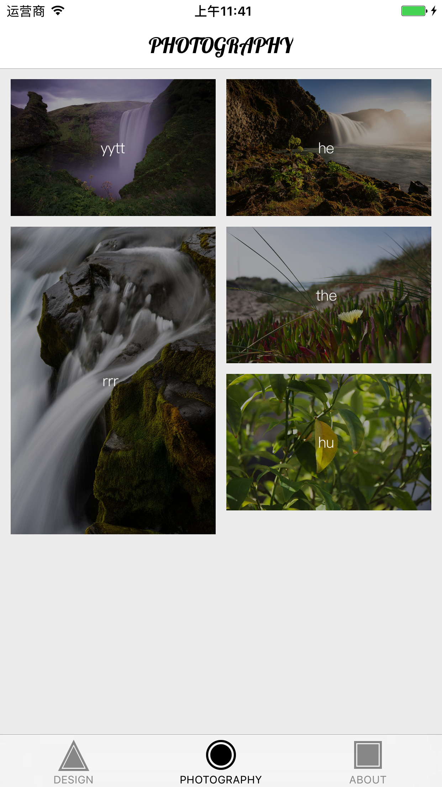
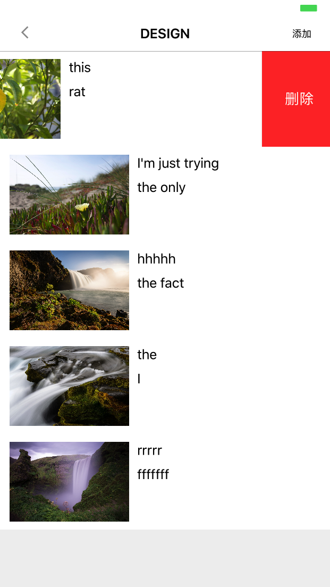
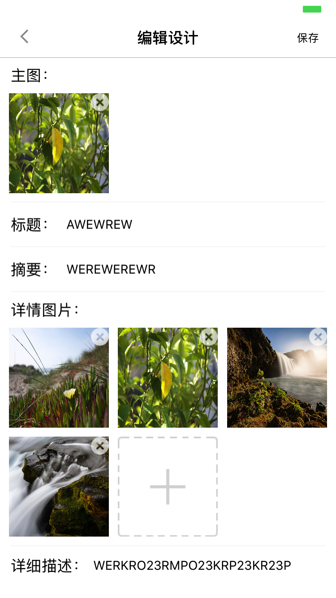

## ANDESIGN

Andesign is a local upload and data persistence app.It contains three parts:

- DESIGN
- PHOTOGRAPHY
- ABOUT

## FUNCTIONS
Design shows the personal works by cells,you can click it to see the detail:

and Photography is a display stand for our private photo using waterFlow layout,

the part of About plays a manager for the app,you can edit not only the Design but also the Photography. What's more,you can upload you data from your photo album in it.

##LISENCE
Released under the MIT license. See LICENSE for details.
